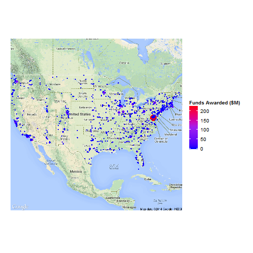

## Background

Like it or not most technical innovation comes out of academia, which is typically funding through government initiatives. The fields most likely to have the largest impact on society are those in the sciences.  The National Science Foundation (NSF) aims to provide funding to the best research ideas in the sciences.

---
## The Problem

As an investor how does one determine where the best research is being done?  Do we look at papers?  How do we know what research will have the largest imapct?

---
## An Idea

The NSF has teams of people reading through research proposals to find the most interesting, exciting and plausible research.  We can use their efforts to our advantage in finding research opportunities.  Since we know that it takes a few years for technical ideas to develop in research, we can plot where the largest amount of funds are being allocated by the NSF in a given year.  From there we can look through the most exciting papers from universities in those areas to get an idea about what technologies will be on the rise.  We can then allocate our portfolio to capture those emerging opportunitues.

---
## The Solution
Where will the future be next?

 
